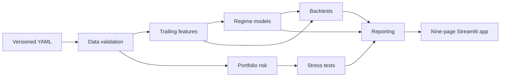

# Market Regime + Portfolio Risk Platform

[](https://github.com/Jakey794/market-regime-risk-platform/actions/workflows/ci.yml)
[](https://www.python.org/)
[](LICENSE)

A Python research platform for **portfolio risk measurement**, **market-regime
analysis**, **stress testing**, and **no-look-ahead backtesting**.

This is **not** a stock-prediction app. It does not claim reliable alpha,
guaranteed risk reduction, or investment performance.

The goal is to study how portfolios behave across changing market environments
and to produce interpretable, leakage-aware research outputs.

## Why this exists

Market risk research is easy to make look more certain than it is. This project
keeps the analytical pipeline explicit: inputs are validated, learned
transformations are fitted only on chronological training data, and backtests
separate signal, decision, execution, and return-realization dates.

It is intended as a reproducible engineering and research demonstration, not as
investment guidance or a deployable trading system.

## v1.0 status

| Week | Deliverable | Status |
| --- | --- | --- |
| 1 | Config-driven ETF ingestion, Parquet cache, validation | Complete |
| 2 | Risk / return / drawdown / tail / performance metrics | Complete |
| 3 | Portfolio config, concentration, correlation, beta, risk contribution | Complete |
| 4 | Four-page Streamlit dashboard on the risk engine | Complete |
| 5 | Leakage-safe regime feature engineering + diagnostics page | Complete |
| 6 | Threshold, KMeans, GMM, HMM, and change-point models | Complete |
| 7 | Historical, deterministic, and regime-conditioned stress tests | Complete |
| 8 | Shifted-signal, cost-aware backtesting | Complete |
| 9 | Quarterly memo and research-report generation | Complete |
| 10 | Nine-page Streamlit research dashboard | Complete |

The implementation is production-shaped research software, not a live trading
system. See `PROJECT_COMPLETION.md` for acceptance evidence and remaining limits.

## Quickstart

```bash
uv sync
make data        # download and cache adjusted-close prices
make features    # build raw + train-scaled regime features
make feature-check
make models
make stress
make backtest
make report
make dashboard   # launch the Streamlit app
make test
make check       # ruff lint + format check + pytest
```

The dashboard starts with deterministic synthetic data when a local market-data
cache is absent. This makes a fresh clone runnable without credentials or a
network download. To refresh observed ETF data locally, run `make data`; those
generated cache files are deliberately not versioned.

## What it demonstrates

- Config-driven ETF data validation and portfolio construction
- Trailing risk features with chronological splits and train-only scaling
- Interpretable, clustering, mixture, HMM, and change-point regime methods
- Historical replay and explicitly labeled deterministic stress estimates
- Shifted-signal backtests with turnover and transaction costs
- Deterministic Markdown reporting and a nine-page Streamlit interface
- Future-mutation tests proving later observations do not alter prior outputs

```bash
make features
make feature-check
```

## Dashboard

```bash
make dashboard
```

Pages:

1. Portfolio Overview
2. Risk Metrics
3. Correlation & Beta
4. Data Quality
5. Regime Feature Diagnostics
6. Regime Detection
7. Stress Tests
8. Backtest Lab
9. Quarterly Memo

The dashboard reports historical, deterministic estimates for research purposes
only. It is not financial advice.

## Reproducibility and data

- `data/sample/synthetic_prices.parquet` is the tracked, deterministic demo
  fixture. Its construction and limits are documented in
  [`data/sample/README.md`](data/sample/README.md).
- `make data` downloads a local cache using the configured universe. It may
  change as providers revise history and is not a source of record.
- Generated regime features, fitted models, stress results, backtests, and
  downloaded price caches remain local. Re-run the documented commands to
  reproduce them from an appropriate data source.
- The project has no brokerage integration, order execution, or claim of
  predictive performance.

## Architecture



Streamlit pages stay thin and call package APIs. Notebooks must call the same
package code rather than reimplement financial logic.

## Repository Structure

```text
configs/       Universe, portfolio, feature, model, stress, backtest configs
app/           Streamlit entrypoint and nine research pages
data/          Sample demo data + generated processed artifacts (mostly ignored)
notebooks/     Feature, model, backtest, and failure-analysis notebooks
reports/       Memo example, final research report, architecture notes
scripts/       Reproducible CLI workflows
src/mrrp/      Project package (data, risk, features, models, stress, backtest, reporting)
tests/         Offline unit tests and Streamlit AppTests
.github/       GitHub Actions CI
```

## Validation Commands

| Command | Purpose |
| --- | --- |
| `make setup` | Install dependencies with `uv sync` |
| `make data` | Build adjusted-close cache |
| `make features` | Build regime feature artifacts |
| `make feature-check` | Validate feature artifacts |
| `make models` | Fit configured regime models |
| `make stress` | Run configured stress scenarios |
| `make backtest` | Run shifted-signal backtests |
| `make report` | Generate Markdown reports |
| `make dashboard` | Launch Streamlit |
| `make test` | Run pytest |
| `make lint` | Ruff lint |
| `make check` | Lint + format check + tests |
| `make format` | Apply Ruff formatting |
| `make clean` | Remove local caches |

## Limitations

- Free ETF data is not institutional-grade and may contain missing, revised, or
  inconsistent observations.
- This project is not financial advice.
- This project is not a return prediction system.
- This project does not perform live trading or live order execution.
- Regime features describe historical risk conditions; they are not forecasts.
- HMM and clustering state identities are sample- and specification-dependent.
- Historical backtests can overfit research choices and use a simplified cost model.
- The tracked sample dataset is deterministic and synthetic, for demos only.

## Deployment

This is a Streamlit application, not a Vite/React or Vercel site. Configure a
host to install from `requirements.txt` and launch `app/streamlit_app.py`.
`st.set_page_config` supplies a distinct browser title for every dashboard page,
a favicon, and a responsive wide layout. See
[`docs/DEPLOYMENT.md`](docs/DEPLOYMENT.md) for a pre-launch checklist.

Screenshot placeholders for a future release are listed in
[`docs/DEMO_SCRIPT.md`](docs/DEMO_SCRIPT.md); no screenshots are represented as
completed assets.

## Contributing and security

Contributions are welcome through focused pull requests. Read
[`CONTRIBUTING.md`](CONTRIBUTING.md), [`CODE_OF_CONDUCT.md`](CODE_OF_CONDUCT.md),
and [`SECURITY.md`](SECURITY.md) first.

## License

Released under the [MIT License](LICENSE). If you use this work in research,
please cite it using [`CITATION.cff`](CITATION.cff).
