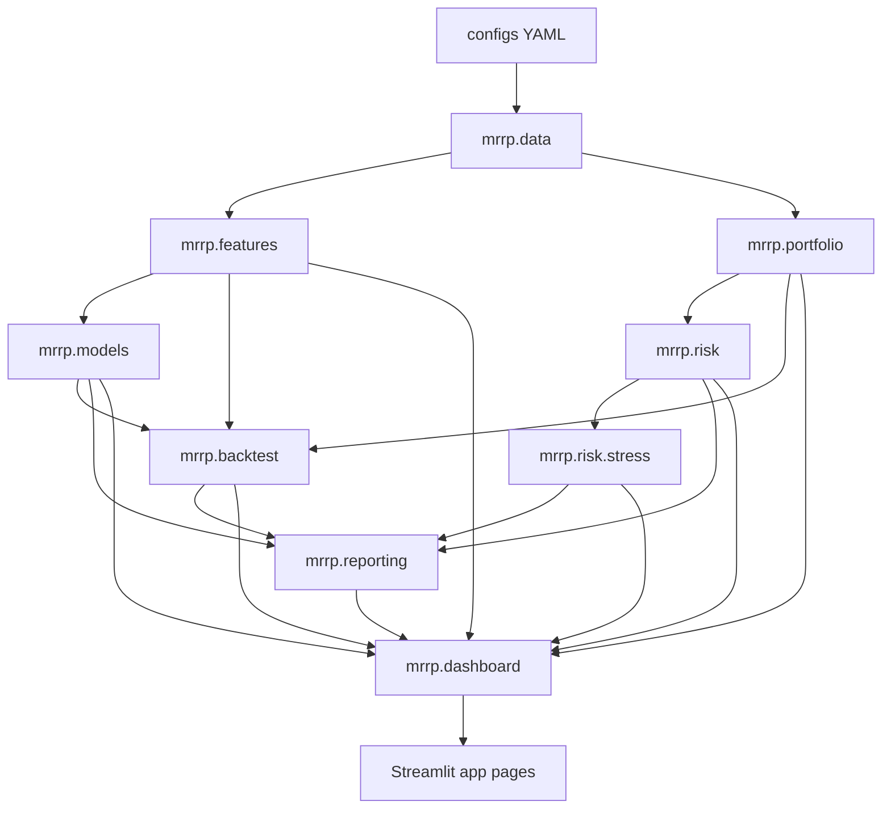

# Architecture

```mermaid
flowchart TD
  configs[configs YAML] --> data[mrrp.data]
  data --> features[mrrp.features]
  data --> portfolio[mrrp.portfolio]
  portfolio --> risk[mrrp.risk]
  features --> models[mrrp.models]
  risk --> stress[mrrp.risk.stress]
  models --> backtest[mrrp.backtest]
  features --> backtest
  portfolio --> backtest
  risk --> reporting[mrrp.reporting]
  models --> reporting
  stress --> reporting
  backtest --> reporting
  portfolio --> dashboard[mrrp.dashboard]
  risk --> dashboard
  features --> dashboard
  models --> dashboard
  stress --> dashboard
  backtest --> dashboard
  reporting --> dashboard
  dashboard --> app[Streamlit app pages]
```
